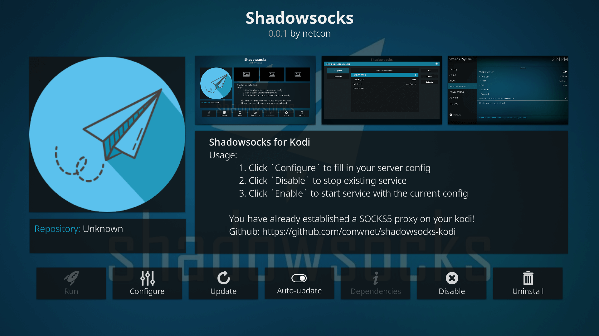

<p align="center"><a href="https://vuejs.org" target="_blank" rel="noopener noreferrer"></a></p>


<h3 align="center">
    Run Shadowsocks on Kodi!
</h3>

## Get Started

You can download the latest version from [Github Releases](https://github.com/conwnet/shadowsocks-kodi/releases)

1. Install the addon on your kodi.
2. Configure your Shadowsocks.
3. Restart services to take effect.

## Check up

You can login your kodi with ssh and display the ports usage.

As shown below, we can see our Shadowsocks services running at PID 653.

```
LibreELEC:~ # netstat -lntp
Active Internet connections (only servers)
Proto Recv-Q Send-Q Local Address           Foreign Address         State       PID/Program name
...
tcp        0      0 127.0.0.1:1080          0.0.0.0:*               LISTEN      653/kodi.bin
...
```

You can test whether your services work as your expected use `curl`.

```
LibreELEC:~ # curl -x socks5://127.0.0.1:1080 ifconfig.io/ip
```

## Screenshots


